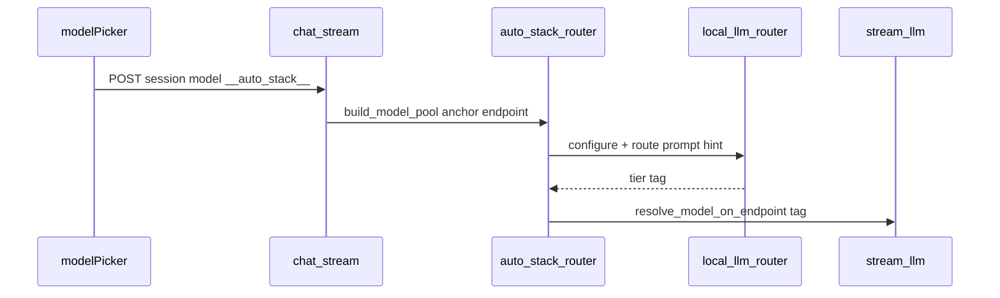

# Integrating local-llm-router

local-llm-router is a **routing library**: it picks `(tier, model_tag)` before each LLM call. It does not run inference, tools, or memory.

## One engine, two entry points

Both paths call the same `explain_route()` core. Pick based on who owns the model list.

| Pattern | Who | Setup | Per step |
| --- | --- | --- | --- |
| **Session (embedded)** | App devs | `configure()` once | `route()` / `explain()` |
| **Explicit (power user)** | Gateways, tests | `assign_tiers(models)` | `route_prompt()` / `explain_route()` |

**Embedded apps:** import is silent by default. Use `llm-router tips` in dev, or `local_llm_router_IMPORT_TIPS=on` for one-time stderr tips.

### Progressive disclosure (same session API)

You stay on `configure()` → `route()` until you need more control:

| Level | When | Example |
| --- | --- | --- |
| **0 — preset** | Trust the 16 GB ladder | `configure(vram_gb=16, quant="qat")` |
| **1 — explicit models** | You know your tags | `configure(vram_gb=16, models=[...])` |
| **2 — custom ladder** | Pin slots yourself | `configure(..., models=[...], tiers=TierMap(...))` |
| **3 — no session** | Full ownership, no globals | `route_prompt(text, assign_tiers([...]), hint=...)` |

Level 3 is for gateways and unit tests. Levels 0–2 share env vars, warnings, and `describe_session()` logging.

---

## Convenient: configure once

```python
import local_llm_router

local_llm_router.configure(
    vram_gb=16,
    quant="qat",
    models=["gemma4:e4b", "qwen3:8b", "qwen3:14b"],  # explicit list recommended
)

for step in agent_steps:
    tier, model = local_llm_router.route(step.prompt, hint=step.kind)
    response = your_ollama_client.generate(model=model, prompt=step.prompt)
```

Environment (optional):

```bash
export local_llm_router_VRAM_GB=16
export local_llm_router_QUANT=qat
# export local_llm_router_PROFILE=workstation_16gb
```

### Validate after configure

```python
session = local_llm_router.configure(vram_gb=16, models=[...])
for warning in session.warnings:
    logging.warning("local_llm_router: %s", warning)
```

### Custom tier ladder (level 2)

```python
from local_llm_router import TierMap, configure, route

configure(
    vram_gb=16,
    quant="qat",
    models=[
        "gemma4:e4b",
        "qwen3:8b",
        "qwen3:14b",
        "deepseek-coder:6.7b",
    ],
    tiers=TierMap(
        simple="gemma4:e4b",
        medium="qwen3:8b",
        complex="qwen3:14b",
        reasoning="qwen3:14b",
        code="deepseek-coder:6.7b",
    ),
)
tier, model = route(step.prompt, hint="code")
```

Or CLI:

```bash
llm-router explain --prompt "what is JWT?" --hint lookup --profile workstation_16gb --quant qat --json
```

---

## Power user: explicit tier map

```python
from local_llm_router import assign_tiers, explain_route, route_prompt

tiers = assign_tiers([
    "gemma4:e4b",
    "qwen3:8b",
    "qwen3:14b",
    "deepseek-coder-v2:16b",  # optional code slot
    "deepseek-r1:8b",         # optional reason slot
])

decision = explain_route(step.prompt, tiers, hint="code")
tier, model = decision.tier, decision.model
# or: tier, model = route_prompt(step.prompt, tiers, hint="code")
```

Custom registry: copy `config/models.example.json` → `local-llm-router.models.json` or set `LOCAL_LLM_ROUTER_MODELS_CONFIG`.

---

## Agent loop logging (recommended JSON shape)

Log once at startup:

```json
{
  "event": "local_llm_router.session",
  "profile": "workstation_16gb",
  "quant": "qat",
  "models": ["gemma4:e4b", "qwen3:8b", "qwen3:14b"],
  "tiers": {"simple": "gemma4:e4b", "medium": "qwen3:8b", "complex": "qwen3:14b", "reasoning": "qwen3:14b", "code": null},
  "warnings": ["No code specialist in models= — hint='code' uses the complex tier (qwen3:14b)."]
}
```

Log every step:

```python
decision = local_llm_router.explain(step.prompt, hint=step.kind)
log.info({"event": "local_llm_router.route", **decision.to_dict()})
tier, model = decision.tier, decision.model
```

Or minimal:

```python
tier, model = local_llm_router.route(step.prompt, hint=step.kind)
```

---

## Hints (required for efficiency)

| hint | tier | Typical model (3-model stack) |
| --- | --- | --- |
| `lookup` | simple | gemma4:e4b |
| `explain` | medium | qwen3:8b |
| `design` | complex | qwen3:14b |
| `code` | complex + code slot | coder if in `models=`, else qwen3:14b |
| `reason` | reasoning | R1/phi-reasoning if in `models=`, else qwen3:14b |

Your orchestrator should set `hint=` when it knows the step type. Without hints, keyword heuristics guess (fine for demos, bad for production).

---

## CLI checklist for new devs

```bash
pip install -e ".[ollama]"

llm-router stacks --profile workstation_16gb --quant qat
llm-router explain --prompt "what is JWT?" --hint lookup \
  --models gemma4:e4b,qwen3:8b,qwen3:14b --json

python examples/agent_runner/run.py --verbose --vram-gb 16 --quant qat \
  --models gemma4:e4b,qwen3:8b,qwen3:14b
```

---

## Odysseus (optional Auto stack)

[Odysseus](https://github.com/pewdiepie-archdaemon/odysseus) integrates local-llm-router as an **optional** admin feature (`auto_stack_enabled`). When a user picks **Auto stack** in the model picker, the session stores sentinel `__auto_stack__` and routes each LLM call on the **anchor endpoint only** (local Ollama/vLLM).



**Install (Odysseus side):**

```bash
pip install -r requirements-optional.txt   # includes local-llm-router[ollama]
```

**Hook points (upstream PR series):**

| Layer | Module | Role |
| --- | --- | --- |
| Lazy import | `src/local_llm_router_runtime.py` | Graceful 503 if missing |
| Router | `src/auto_stack_router.py` | Pool, `resolve_model_on_endpoint`, hints, stack-only fallbacks |
| Chat | `routes/chat_routes.py` | Resolve once before `stream_llm_with_fallback`; SSE `model_info` shows resolved tag |
| Agent | `src/agent_loop.py` | Per-round resolve + recompute `_is_api_model`; SSE `model_resolved` |
| UI | `static/js/modelPicker.js`, `settings.js` | Toggle, VRAM/quant, Auto stack row |

**Settings keys:** `auto_stack_enabled`, `auto_stack_vram_gb` (0 = hwfit detect), `auto_stack_quant`, `auto_stack_models` (optional override list).

**Non-goals:** Replace teacher escalation, Compare mode, research model, or cloud endpoints.

Design discussion: [Odysseus issue #3073](https://github.com/pewdiepie-archdaemon/odysseus/issues/3073).

---

## What local-llm-router does not do

- Pick quant per prompt (set `quant=` once)
- Detect GPU automatically (you pass `vram_gb`)
- Run chat/tools/history (your client)
- Guarantee benchmark optimality (presets are starting points)

See also: [`LOCAL_MODELS.md`](LOCAL_MODELS.md), [`examples/agent_runner/run.py`](../examples/agent_runner/run.py).
